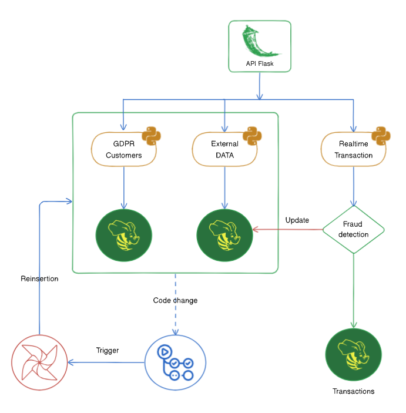
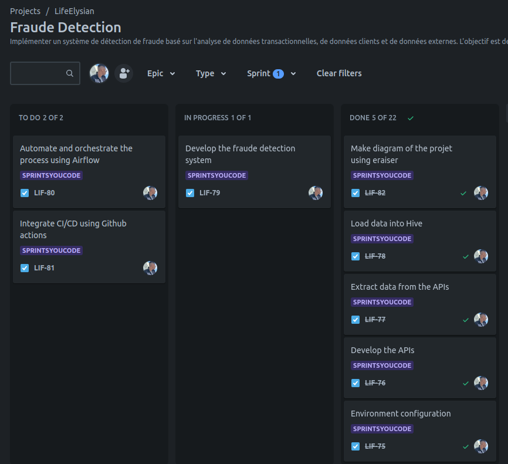

# Project Context

As a Data Developer, the objective is to detect suspicious activities in near real-time and minimize false alerts.

### Usage of Jira to Plan the Project

Before delving into the core of the project, a data governance and a plan of RGPD conformity were established. Both documents are located in the `documentation/` folder.

## Development of APIs

### API for Transaction Data
Implement an endpoint `/api/transactions` to access transaction data, including transaction ID, date and time, amount, currency, merchant details, customer ID, and transaction type.

### API for Customer Data
Develop an endpoint `/api/customers` to access customer data such as customer ID, account history, demographic information, and behavioral patterns.

### API for External Data
Establish an endpoint `/api/externalData` to retrieve external data, including blacklist information, credit scores, and fraud reports.

## Data Collection and Integration

Utilize the developed APIs to collect transactional, customer, and external data.

Ensure that the collected data is clean, relevant, and in a format suitable for analysis.

## Storage and Data Management with Hive

Design and implement Hive tables to store transaction, customer, and external data.

Apply partitioning or bucketing strategies for efficient data management.

## Development of the Rule-Based Fraud Detection System

Use HiveQL to write queries that flag transactions based on identified fraud indicators. Examples of rules include detecting abnormally high transaction amounts, high transaction frequency in a short period, transactions from unusual locations, and transactions with customers on the blacklist, among others.

## Deployment

Set up an Airflow Directed Acyclic Graph (DAG) to orchestrate the data collection, processing, and alerting process.

Integrate Continuous Integration/Continuous Deployment (CI/CD) with GitHub Actions for automatic and secure updates of scripts and DAGs.

## Environment Configuration

Docker Compose was used for configuring the environment for Hive and HDFS. Airflow was deployed on Linux.
